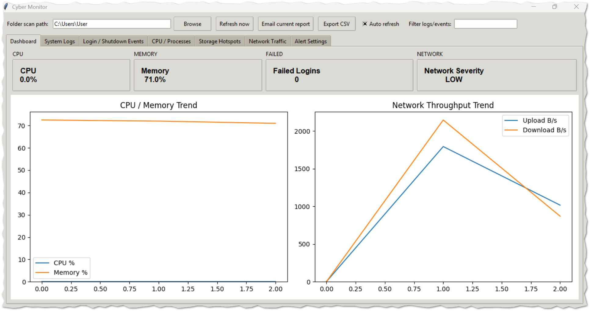
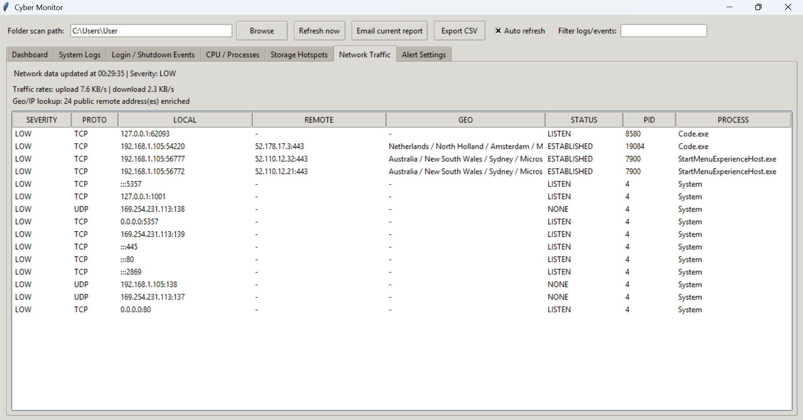
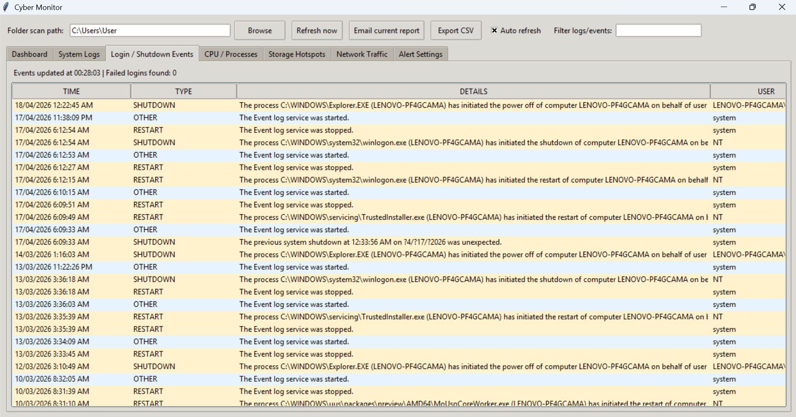
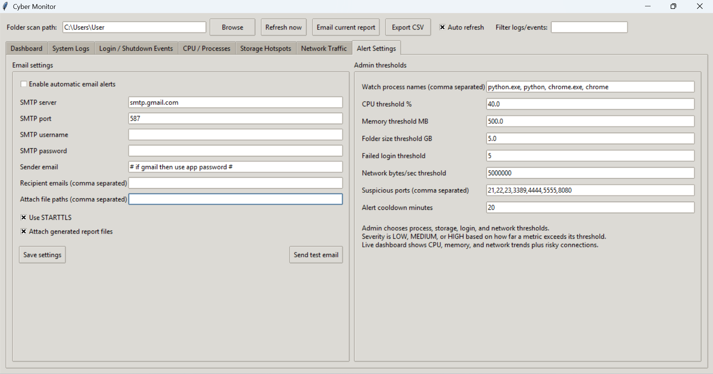

# Cyber Monitor


A lightweight cybersecurity desktop monitoring tool.


## 🚀 Key Features

- 🔍 **Real-Time System Monitoring**  
  View live system logs, events, and activities in one dashboard.

- 🔐 **Login & Security Event Tracking**  
  Detect failed logins, authentication attempts, and system access behavior.

- ⚙️ **Process & Resource Analysis**  
  Identify high CPU and memory usage processes with severity classification.

- 💾 **Storage Hotspot Detection**  
  Discover folders consuming excessive disk space.

- 🌐 **Network Traffic Monitoring**  
  Track active connections, protocols, and remote endpoints.

- 📍 **Geo/IP Intelligence**  
  Enrich remote IPs with location and ISP information.

- 🚨 **Severity-Based Alerting**  
  Classify events as LOW / MEDIUM / HIGH based on thresholds.

- 📧 **Automated Email Alerts**  
  Notify administrators when suspicious activity is detected.

- 📊 **Data Export & Reporting**  
  Export system data into CSV format for analysis and documentation.

- 🖥️ **SOC-Inspired Dashboard UI**  
  Designed to simulate a lightweight Security Operations Center interface.

---

### Features
- Real-time system log monitoring  
- Login and shutdown event tracking  
- CPU and memory process monitoring  
- Storage hotspot detection  
- Network traffic analysis with Geo/IP lookup  
- Severity-based alert classification  
- Email alerting system  
- CSV report export  

### Notes
- Requires Python 3.10+  
- Internet required for Geo/IP enrichment  
- Administrator privileges may be needed for full system visibility  
- Windows Defender may show warnings for unsigned `.exe`

---


## Run
```bash
pip install -r requirements.txt
python cybermonitor.py
```

## Screenshot of dashboard

## Screenshot of network traffic

## Screenshot of logs events 

## Screenshot of alert settings 



## Demo & Tutorial

See [DEMO_TUTORIAL.md](DEMO_TUTORIAL.md) for a full walkthrough, demo flow, and presentation guide.
---
## ⚠️ Disclaimer

This software is developed for educational and demonstration purposes only.  
It is not intended for production or enterprise-level security use.

The application provides system monitoring features such as logs, process activity, 
and network connections for learning and analysis purposes only.

Users are responsible for how they use this software. The author is not liable for 
any misuse or damage caused.

---

## 🔐 Security & Privacy Notice

- This application does **not collect or transmit personal data** without user configuration.
- Email alerts require manual SMTP setup by the user.
- No credentials are stored externally.
- Geo/IP lookup uses a public API and only queries external IP addresses.

---

## 📜 License

This project is licensed under the **GNU General Public License v3.0 (GPL-3.0)**.

You are free to:
- Use
- Modify
- Distribute

Under the condition that:
- Modified versions must also be open-source under the same license

See the `LICENSE` file for full details.

---

## 👤 Author

**Apel Mahmud**  
Cybersecurity Student Project  

🔗 Repository: https://github.com/cseapel/cybermonitor

---

